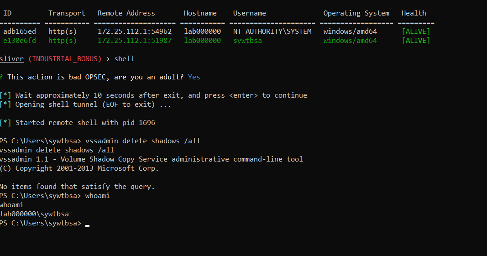
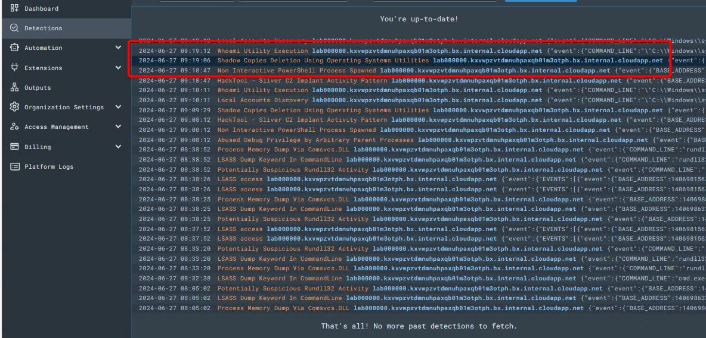
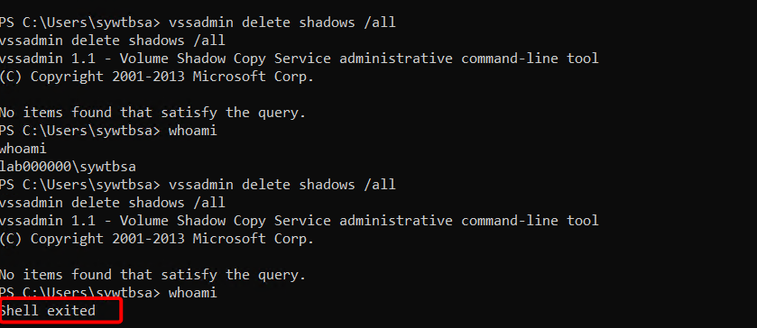

# Blocking-Attacks-in-LimaCharlie-EDR

## Objective

This document outlines the process of crafting and deploying an effective detection and blocking rule within a cybersecurity environment, specifically targeting ransomware behaviors. The focus is on creating a rule to detect and block the deletion of volume shadow copies, a common action taken by ransomware to prevent data recovery. The document emphasizes the importance of proper baselining to avoid false positives, which involves running alert-only detection rules and fine-tuning them before deploying the blocking version.

The rationale for this specific rule is provided: volume shadow copies allow for data recovery, making them a target for ransomware. The command `vssadmin delete shadows /all` is identified as a key indicator of such an attack. The document details the prerequisites, such as having an active Sliver C2 session, and provides step-by-step instructions for setting up the environment, including connecting to the VM and launching the Sliver client.

The core of the document guides you through executing the deletion command within a Sliver C2 session to generate the necessary telemetry for detection. It then explains how to craft a detection and response (D&R) rule using LimaCharlie, designed to report the activity and terminate the parent process of the malicious command. Finally, it details testing the rule by re-running the command and verifying that the D&R rule successfully terminates the process, ensuring the detection and response mechanism works effectively. The document concludes by encouraging further refinement and testing of the rule to account for various scenarios and enhance robustness.

### Skills Learned

1. **Baselining Techniques**:
   - Understanding the importance of baselining to minimize false positives.
   - Crafting and tuning alert-only detection rules.
   - Deploying blocking rules after sufficient baselining.
2. **Adversary Emulation**:
   - Using Sliver to simulate attacker behavior.
   - Generating and deploying C2 payloads.
   - Establishing and managing C2 sessions.
3. **Command Execution and Monitoring**:
   - Running system commands within a C2 session.
   - Monitoring and verifying the execution of commands.
   - Gathering telemetry data for detection purposes.
4. **Detection and Response Rule Creation**:
   - Crafting detection rules to identify malicious activities.
   - Creating response actions to mitigate threats.
   - Using Sigma rules and YARA signatures for enhanced detection.
5. **Incident Response**:
   - Simulating ransomware attacks.
   - Developing and testing blocking rules to terminate malicious processes.
   - Validating the effectiveness of detection and response strategies.
6. **Tool Proficiency**:
   - Navigating and using Sliver for adversary emulation.
   - Operating within a Sliver C2 session.
   - Leveraging LimaCharlie for detection and response.
   - Utilizing PowerShell for command execution on Windows systems.

### Tools Used

1. **Sliver**:
   - For generating and deploying C2 payloads.
   - For establishing and managing C2 sessions.
2. **Linux VM**:
   - As the control hub for running the Sliver server.
   - For generating and transferring payloads.
3. **Windows VM**:
   - As the target system for deploying and executing the payload.
4. **SSH**:
   - To access and manage the Linux VM.
5. **Python Web Server**:
   - For transferring the payload from the Linux VM to the Windows VM.
6. **PowerShell**:
   - For executing commands on the Windows VM.
7. **LimaCharlie**:
   - For creating and managing detection and response rules.
   - For monitoring and analyzing telemetry data.
8. **Sigma Rules**:
   - For standardized detection rule creation.
9. **YARA Signatures**:
   - For identifying and categorizing malware based on patterns.

# Steps: Simulating and Detecting Ransomware Activity with Sliver and LimaCharlie

These steps are part of a lab exercise to simulate and detect ransomware activity using Sliver and LimaCharlie. The goal is to run a command commonly associated with ransomware, generate telemetry data, and create a detection and response rule to block such activity in the future.

## 1. Dropping into a C2 Session on the Victim:

This step ensures you are connected to the compromised machine (victim) through the Sliver C2 session. This connection allows you to issue commands to the target system as an attacker would.

## 2. Dropping to a System Native Command Prompt:

By running the shell command within the Sliver session, you gain access to the system's native command prompt. This is essential for executing commands that interact directly with the operating system, simulating real-world attacker behavior.

```
shell
```

## 3. Executing the vssadmin delete shadows /all Command:

This command is typically used by ransomware to delete volume shadow copies, which are backups that could be used to recover files after an attack. Running this command simulates a key action of a ransomware attack, generating telemetry data for detection purposes.

When prompted with “This action is bad OPSEC, are you an adult?” type Y and hit enter.


In the new system shell, run the following command

```
vssadmin delete shadows /all
```

The output is not important as there may or may not be Volume Shadow Copies available on the VM to be deleted, but running the command is sufficient to generate the telemetry we need.

## 4. Verifying the Active System Shell

Running the whoami command confirms that the C2 session is still active and the system shell is functional. This ensures that the command execution process is working correctly and that telemetry data is being generated.

```
whoami
```



## 5. Checking LimaCharlie’s Detection Tab:

Browse over to LimaCharlie’s detection tab to see if default Sigma rules picked up on our shenanigans.



## 6. Examining Detection Metadata:

Click to expand the detection and examine all of the metadata contained within the detection itself. One of the great things about Sigma rules is they are enriched with references to help you understand why the detection exists in the first place.


One of the reference URLs contains a [YARA signature](https://github.com/Neo23x0/Raccine/blob/20a569fa21625086433dcce8bb2765d0ea08dcb6/yara/gen_ransomware_command_lines.yar) written by Florian Roth that contains several more possible command lines that we’d want to consider in a very robust detection rule

## 7. Viewing the Offending Event in the Timeline:

View the offending event in the Timeline to see the raw event that generated this detection.


From this D&R rule template, we can begin crafting our response action that will take place when this activity is observed.

## 8. Crafting a Detection & Response (D&R) Rule:

Creating a D&R rule based on the observed event automates the response to future similar activities. The rule includes:
Action: report: Sends a detection report to alert security personnel.
Action: task: Executes a task to terminate the parent process of the malicious command, effectively stopping the ransomware activity.

Add the following Response rule to the Respond section

```
- action: report
  name: vss_deletion_kill_it
- action: task
  command:
    - deny_tree
    - <<routing/parent>>
```

## 9. Saving and Testing the Rule:

Naming and saving the rule ensures it is active in the detection system. Testing the rule by rerunning the command verifies its effectiveness in blocking malicious activity.

The “action: report” section simply fires off a Detection report to the “Detections” tab

The “action: [task](https://doc.limacharlie.io/docs/documentation/b43d922abb409-reference-actions#task)” section is what is responsible for killing the parent process responsible with [deny_tree](https://doc.limacharlie.io/docs/documentation/819e855933d6c-reference-commands#deny_tree) for the vssadmin delete shadows /all command.

Save your rule with the following name: vss_deletion_kill_it

## Importance of the Steps
- Simulation and Detection: Running ransomware-like commands generates real-world telemetry, making the detection process realistic and effective.
- Baseline Establishment: These steps help establish a baseline for normal and malicious activities, crucial for minimizing false positives.
- Rule Creation and Testing: Crafting and testing detection and response rules enhance the security posture by automating the response to known malicious behaviors, ensuring quick mitigation.
- Operational Security (OPSEC): Understanding OPSEC considerations and verifying session activity ensures that security measures are working as intended without compromising the integrity of the simulation environment.

---

### Let’s Block It!


Now return to your previous Sliver C2 session, and rerun the command and see what happens.

Run the command to delete volume shadows.

```
vssadmin delete shadows /all
```

1. The command should succeed, but the action of running the command is what will trigger our D&R rule and terminate our C2 implant process

1. Now, to test if our D&R rule properly terminated the parent process of our implant, check to see if you still have an active system shell by rerunning the `whoami` command

If our D&R rule worked successfully, the system shell will hang and fail to return anything from the whoami command, because the parent process was terminated.


This is effective because in a real ransomware scenario, the parent process is likely the ransomware payload or lateral movement tool that would be terminated in this case.

Check the Detections screen to confirm the rule fired


These steps outline a structured approach to creating and implementing a blocking rule in a cybersecurity environment, focusing on mitigating ransomware attacks by detecting the deletion of volume shadow copies. 

1. **Baselining for False Positives**: Before deploying a blocking rule, it's crucial to baseline the environment. This involves initially creating an alert-only detection rule and running it for an extended period (days or weeks). This allows SOC analysts to fine-tune the rule to minimize false positives, ensuring that legitimate activities are not incorrectly flagged as malicious.

2. **Crafting an Effective Rule**: The rule targets the deletion of volume shadow copies, which is a common precursor to ransomware attacks. This action is significant because volume shadow copies are often used for data recovery, making their deletion a strong indicator of malicious intent.

3. **Execution in Controlled Environment**: By using tools like Sliver C2, the deletion command (`vssadmin delete shadows /all`) is executed within a controlled environment. This action generates telemetry data, crucial for detecting and responding to such activities.

4. **Detection and Response (D&R) Rule Creation**: LimaCharlie is utilized to create a D&R rule based on detected telemetry. This rule not only reports the detection (`action: report`) but also initiates a response (`action: task`) to terminate the parent process responsible for the deletion command.

5. **Testing and Validation**: After creating the D&R rule (`vss_deletion_kill_it`), it's essential to test its effectiveness. Re-running the deletion command verifies if the rule successfully terminates the process, mimicking the response in a real-world ransomware scenario.

6. **Confirmation and Iteration**: Checking LimaCharlie's detection tab confirms if the rule fired correctly, indicating successful mitigation. This step allows analysts to iterate and refine the rule further, ensuring it can effectively handle variations of the attack scenario.

These steps collectively build expertise in rule creation, detection tuning, and incident response, crucial for maintaining robust cybersecurity defenses against sophisticated threats like ransomware. They also emphasize the importance of thorough testing and continuous improvement in security operations.
